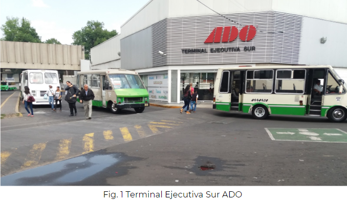

# Viaja Seguro 360

## **Proyecto Sprint #1 | _Track UX Laboratoria_**

**Entender y optimizar el journey de tomar un camión de la CDMX a Cuernavaca**, con el objetivo de conocer el _proceso de diseño_ de una solución tecnológica.

Para ello se requiere la conformación de equipos de al menos 3 personas que cubran los roles de: Product Owner, UX Designer y UX Researcher.

### Equipo

**PO**- Ana Laura Sánchez Tamayo  
**UX Research** - Samahara Fernanández y Nancy Santana  
**UX Design** - Rosa Talía Colunga Tello

## Nuestra idea

Definir una alternativa para aquellos usuarios que tienen complicaciones al buscar un método de **traslado seguro desde su punto de partida hasta la terminal, y de la terminal a su destino**, esto en conjunto con _partners locales_ que nos ayudarán en el proceso de traslado de nuestro usuario, de manera eficiente, segura y cómoda.

## Empatizar 

Para ser capaces de optimizar la experiencia de los usuarios ante los diferentes productos y servicios, es necesario entenderlos y ponerse en su lugar. Para ello se realiza una aproximación a sus intereses y necesidades analizando las siguientes variables dentro del _empathy map_:

- ¿Qué ve?
- ¿Qué dice y hace?
- ¿Qué oye?
- ¿Qué piensa y siente?

Dicho análisis nos permite identificar el problema a resolver, las características del usuario, _pain-points_ y qué beneficios que espera obtener.

## Journey 

* Se toma la decisión de viajar.
* Se analizan las opciones de transporte. 
* Compra del ticket. 
	* Portal de internet.
	* Aplicación.
	* Taquilla.
* **Trayecto a Terminal.**
* Sala de espera (Opcional).
* Abordaje. 
* Trayecto (Actividades del usuario).
	* Entretenimiento (Películas, música, lectura).
	* Descanso. 
	* Monitoreo del trayecto (Ruta y tiempo)
* Arribo a terminal y descenso. 
* **Trayecto a destino.**

El primer paso fue 

## Objetivos de negocio.

-**Corto-Mediano plazo.** Se pretende que la idea quede implementada y operando en un plazo de 1 mes y a 2 o 3 meses se refleje el retorno de inversión.   
-**Específico.** Se atiende un pain point específico del usuario, seguridad.  
-**Estratégico.** Atraeremos la atención del usuario de nuestra marca sobre otras, aumentaremos las ganancias gracias a nuestro servicio.  
-**Cuantitativo.** Se reflejará en los número de ganancias.  
-**Cualitativo.** Se reflejará en la percepción de nuestros usuarios (“Me gustó el servicio”, “Lo seguiré usando”, etc).  

## Objetivos del usuario.

* Hacerlo sentir que viaja seguro.
* Facilitarle el traslado entre sus punto de partida, hasta su destino.
* Que el usuario se sienta cómodo.

## Perfil de usuario

* Adulto-joven 
* Sabe de tecnología
* Tiene tarjeta de crédito 
* Vive en el área metropolitana
* +_$4,000_ MN
* No es viajero frecuente
* Viaja por placer
* Viaja acompañado
* Vive solo
* Es organizado

## Research

## Field Research

Se realizó investigación de campo directamente en la Central de Autobuses del Sur, realizando el traslado en transporte público (microbus), desde el paradero Norte CETRAM de Taxqueña. 

Llegando al paradero encontramos rápidamente la Terminal Ejecutiva Sur de ADO (Fig. 1), misma que tiene difícil acceso peatonal debido a que los camiones pasan a alta velocidad o se estacionan enfrente, el acceso vehícular se da por la calle posterior, la cual también transitada constantemente por los camiones que ingresan al paradero. 

Continuando con nuestro recorrido atravesamos el paradero norte (Fig. 2) y hay que cruzar por la Terminal del STCM Línea 2. Una vez ubicada la salida por medio de preguntas y tratado de encontrar la señalización, procedimos a bajar del puente y nos encontramos con una gran cantidad de puestos ambulantes que dificultan y vuelven laberíntico el camino a la Terminal de autobuses. 

Una vez en la terminal  se ubica el estacionamiento, la base de taxis de la terminal y la entrada al interior. 

Ya dentro nos dedicamos a observar la distribución de las salas, ubicar los espacios de reservación de taxis de la terminal y encontramos que el sitio tiene ya tarifas predeterminadas respecto de la zona a la que se dirija el usuario (Fig. 4) tanto para servicio regular y nocturno. 

La mayor parte de la vía de ascenso y descenso (Fig. 5) está ocupada por la fila de taxis y vehículos privados o taxis de fuera quedan confiados al segundo carril, dificultando las maniobras para el viajero.

Se puede ver el área de espera de taxis de la terminal (Fig. 6), las personas se van formando y se les asigna un vehículo. 

### Conclusiones

* El arribo a la terminal en transporte público es inseguro y difícil.
* El acceso a a a terminal en taxi, servicio privado o vehículo de algún conocido/familiar  está limitado en tiempo a menos que se use el estacionamiento. 
* Tomar un taxi de la terminal puede requerir de tiempos de espera prolongados.
* Los sitios hacen uso de tarifas predeterminadas respecto a la zona, lo que facilita la implementación de una tarifa al reservar. 

## Encuesta

Se eligió como herramienta *Google Forms*, y se plantearon un total de 25 preguntas entre las cuales se eligieron las 10 más relevantes para el proceso de investigación.

**Enlace de la encuesta:**  https://goo.gl/forms/TTOiHSmOfwvuiOm93

### Estrategia de Difusión 

**Redes sociales:** Whatsapp, familiares y amigos. Facebook, nuestros perfiles personales y grupos de viajeros. 

### Observaciones

Enlace a la hoja de cálculo con los resultados: https://goo.gl/uGT26S

La encuesta se cerró con 67 respuestas de las cuales:

- Una de las mayores preocupaciones de los usuarios que viajan a otro estado es la seguridad (en su mayoría mujeres prefieren seguridad sobre precio).  
- El 49.3% de los usuarios utilizan servicios como taxi o Uber para trasladarse de su casa a la terminal de autobuses. 
- El 66.7% de los usuarios utilizan servicios como taxi o Uber trasladarse de la terminal a su destino. 
- El 48% de los encuestados utilizan uber porque es más seguro y práctico de utilizar.  
- El taxi fuera de la terminal obtuvo media de 5 debajo de servicios como Uber o transporte privado de la línea.  
- El 74.6% de los encuestados ha realizado compras por Internet y 44.7% lo hace de manera regular.  
- A 73.1% (49 personas) de nuestros encuestados, les resultaría cómodo resolver su transporte hacia la terminal y posteriormente a su destino, en una misma compra. A 22.4% (15 personas) les resultaría cómodo. 

### Los tres _insights_ más importantes: 

* Observamos que de las 67 personas encuestadas 67,2% su mayor preocupación fue la seguridad, validando que nuestro pain-point de partida era el correcto. 
* 49,3% prefiere utilizar un transporte privado por encima de un transporte público, tomando en cuenta que un transporte público es más accesible económicamente.
* 73,1% les resultaría cómodo resolver su traslado en una misma compra, dando luz verde a que la propuesta pueda ser aplicada.

## Definir

Para comenzar la definición de la marca es importante definir _¿Qué tipo de producto tengo?_ así como _¿Qué hay afuera y qué está haciendo la competencia?_

**Dónde va a vivir el proyecto**

Dado que el proyecto funciona por medio de alianzas con partners locales, se plantea como un servicio adquirible dentro del mismo proceso de compra de boletos de autobús a través de internet.
Físicamente sería visible mediante un banner en el sitio web y estaría disponible opcionalmente dentro del formulario de compra.

**Análisis de competencia**

Conocer aquello que hace la competencia y que sí le está funcionando así como aquello que no, nos ayuda a enfocarnos en nuestra propuesta para potenciar lo que nos diferenciará.

## Idear

**Diseño centrado en el Usuario**

Dentro de la planeación estratégica centrada en las necesidades de seguridad y comodiad al transportarse, de nuestro usuario podemos identificar lo siguiente:

##### **Usuario**

**Necesidades**: Transporte de punto de partida hacia la terminal y de la terminal al destino.

**Acciones**: Son la serie de pasos que realiza el usuario desde que accede a la plataforma para adquirir sus boletos, busca el día y hora de su interés, _interactúa con el banner promocional_, elige su(s) asientos, _elige punto de partida y destino final con nuestro servicio_, llena sus datos y finalmente realiza su pago.

##### **Organización**

**Objetivos**: Incrementar ventas y usuarios.

**Métricas**: Número de registros completados en formularios, número de recompras.

##### **Propósito**

Incrementar ventas y atraer usuarios resolviendo la necesidad de transporte hacia y desde la terminal.

### Scketching

A partir de toda la información reunida a través del backlog sobre los objetivos de negocio, las necesidades y expectativas del usuario acerca del servicio, los insights de la validación y el cuadro DCU (Diseño Centrado en el Usuario), nos es requerido por el profesor realizar la planeación de una ***landing page*** que nos identifique como "empresa" y que nos permita medir el interés real de las personas.

Para ello, se realizó un _primer boceto_ tomando en cuenta las observaciones de todo el equipo de trabajo, donde se consideraron los aspectos principales que se querían comunicar acerca del servicio.

Posteriormente, se realizó un segundo boceto donde se propusó con mayor claridad el tipo de gráficos que serían útiles para ilustrar el servicio así como la ubicación de los call to action y formulario.

Una vez realizada una primera versión del sitio tomando en consideración los comentarios del equipo, se sintetizó en mayor medida y se procedió a generar los encabezados y un _tercer boceto_ que contenía de forma más organizada la propuesta

## Landing page 

http://360.pagedemo.co/

## Analytics

## Improvements

## Presentation

## Conclusiones Generales. 
